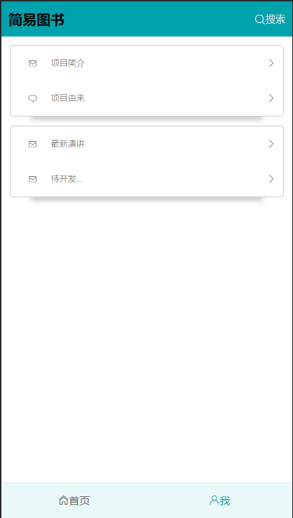

# easybook

> A Vue.js project

## 前言

项目灵感来源于这个[Vue2.0实现简易豆瓣电影webApp](https://github.com/superman66/vue2.x-douban)，还有些思路也参考于这里。既然很多人做豆瓣电影，我来做个简单的豆瓣图书，这里要感谢豆瓣提供的[图书API](https://developers.douban.com/wiki/?title=book_v2)，遗憾的是豆瓣没有提供图书top250的接口，那也要感谢没有提供，于是我自己就想着说通过爬虫获取这份数据，于是另外一个项目[豆瓣图书top250简易爬虫](https://github.com/xxmaa/node-crawler)就催生出来了，就不说别的了。

## 感悟

只有自己动手了，才会遇到很多问题，那么去解决问题的过程中会学到很多知识，也就是慢慢的积累，才会有进步，在这次的项目过程中对这点感悟尤其深刻。因为是初次编写这样一个完整的程序，难免有所错误和疏漏，但我尽力做到了能做的。如果你是新手，那么相信你会学到写东西，尽管代码不是很优秀，希望我们共同学习，共同进步，也希望你能给出自己的建议。如果你是大神，看到有什么不对的地方和错误，还请指正，能帮助我更上一层楼。

## 技术栈
```
基于vue2 + vuex + vue-router + axios + es6 + scss + flex.
```
## 项目本地运行

``` bash
# 下载项目
git clone -b master https://github.com/xxmaa/easybook.git
# 安装依赖
npm install
# 本地调试运行
npm run dev
```
    下载后使用chrome的手机模式打开效果更佳
## 截图





_详情请git clone，然后本地运行_
## 项目结构
```
.
├── build                       // 项目构建(webpack)相关代码
│   ├── build.js                // 生产环境构建代码
│   ├── check-versions.js       // 检查node，npm版本代码
│   ├── dev-client.js           // 热重载相关
│   ├── dev-server.js           // 构建本地服务器
│   ├── utils.js                // 构建工具相关
│   ├── vue-loader.conf.js      // 对vue-loader进行配置
│   ├── webpack.base.conf.js    // webpack基础配置
│   ├── webpack.dev.conf.js     // webpack开发环境配置
│   └── webpack.prod.conf.js    // webpack生产环境配置   
├── config                      // 项目开发环境配置
│   ├── dev.env.js              // 开发环境变量
│   ├── index.js                // 项目配置变量
│   └── prod.env.js             // 生产环境变量
├── index.html                  // 项目主页
├── node_modules                // 模块
├── package.json                // 项目基本信息
├── README.md                   // 项目说明
├── screenshot                  // 截图
│   ├── detail.png
│   ├── index.png
│   ├── me.png
│   └── search.png
├── src
│   ├── api                     // 调用api接口的函数
│   │   └── index.js
│   ├── App.vue                 // 页面入口文件
│   ├── assets                  // 静态资源目录
│   │   ├── images              // 图片
│   │   │   ├── bg.jpg
│   │   │   ├── bg.png
│   │   │   ├── not-found.jpg
│   │   │   ├── path.png
│   │   │   ├── path-use.png
│   │   │   └── top.png
│   │   ├── logo.png
│   │   └── style               // 样式
│   │       ├── app.scss
│   │       ├── _color.scss
│   │       ├── cssreset.css
│   │       ├── mixin.scss
│   │       └── normalize.css
│   ├── components              // 公共组件
│   │   ├── backToTop.vue       // 回到顶部组件
│   │   ├── back.vue            // 返回组件
│   │   ├── Hello.vue           // 自带欢迎页面
│   │   ├── searchItem.vue      // 搜索结果组件
│   │   ├── spinner.vue         // loading图组件
│   │   └── topNav.vue          // 顶部导航组件
│   ├── data                    // 豆瓣图书top250数据
│   │   └── test.json
│   ├── libs                    // 工具函数
│   │   └── utils.js
│   ├── main.js                 // 程序入口文件，加载各种公共组件
│   ├── router                  // 项目路由
│   │   └── index.js
│   ├── store                   // 项目状态管理
│   │   ├── index.js            // 导出store的文件
│   │   ├── modules             // 模块
│   │   │   └── book.js
│   │   └── types.js            // moutations使用的常量
│   └── views                   // 视图页面
│       ├── booklist.vue        // 书籍列表组件
│       ├── detail.vue          // 详情页组件
│       ├── from.vue            // 项目由来组件
│       ├── index.vue           // 首页
│       ├── intro.vue           // 项目介绍组件
│       ├── me.vue              // 关于我
│       ├── news.vue            // 最新演讲组件
│       ├── notfound.vue        // 404页面
│       └── search.vue          // 搜索组件
└── static
    └── caomei                  //草莓图标库
        ├── fonts
        │   ├── strawberryicon.eot
        │   ├── strawberryicon.svg
        │   ├── strawberryicon.ttf
        │   └── strawberryicon.woff
        ├── Read Me.txt
        ├── selection.json
        └── style.css

19 directories, 67 files

```

## 未完成

- [ ] 跨域问题
- [ ] 功能添加

