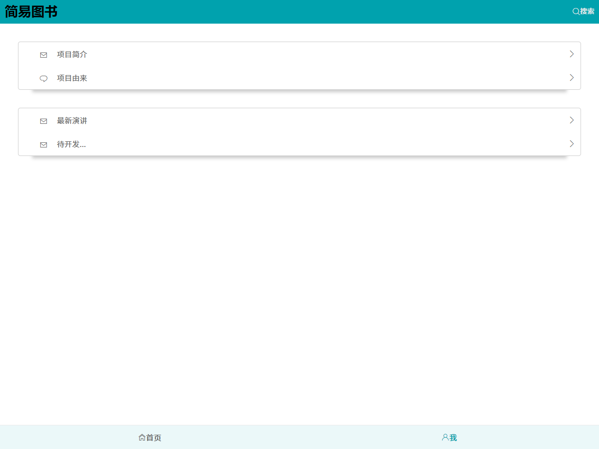

# easybook

> A Vue.js project

## 前言

项目灵感来源于这个[Vue2.0实现简易豆瓣电影webApp](https://github.com/superman66/vue2.x-douban)，还有些思路也参考于这里。既然很多人做豆瓣电影，我来做个简单的豆瓣图书，这里要感谢豆瓣提供的[图书API](https://developers.douban.com/wiki/?title=book_v2)，遗憾的是豆瓣没有提供图书top250的接口，那也要感谢没有提供，于是我自己就想着说通过爬虫获取这份数据，于是另外一个项目[豆瓣图书top250简易爬虫](https://github.com/xxmaa/node-crawler)就催生出来了，就不说别的了。

## 感悟

只有自己动手了，才会遇到很多问题，那么去解决问题的过程中会学到很多知识，也就是慢慢的积累，才会有进步，在这次的项目过程中对这点感悟尤其深刻。因为是初次编写这样一个完整的程序，难免有所错误和疏漏，但我尽力做到了能做的。如果你是新手，那么相信你会学到写东西，尽管代码不是很优秀，希望我们共同学习，共同进步，也希望你能给出自己的建议。如果你是大神，看到有什么不对的地方和错误，还请指正，能帮助我更上一层楼。

## 技术栈
```
基于vue2 + vuex + vue-router + axios + es6 + scss + flex.
```
## 项目本地运行

``` bash
# 下载项目
git clone https://github.com/xxmaa/easybook.git
# 安装依赖
npm install
# 本地调试运行
npm run dev
```

## 截图
1. 首页


2. 搜索页


3. 关于页


4. 详情页


5. 演示


_详情请git clone，然后本地运行_

## 未完成

- [ ] 跨域问题
- [ ] 功能添加

